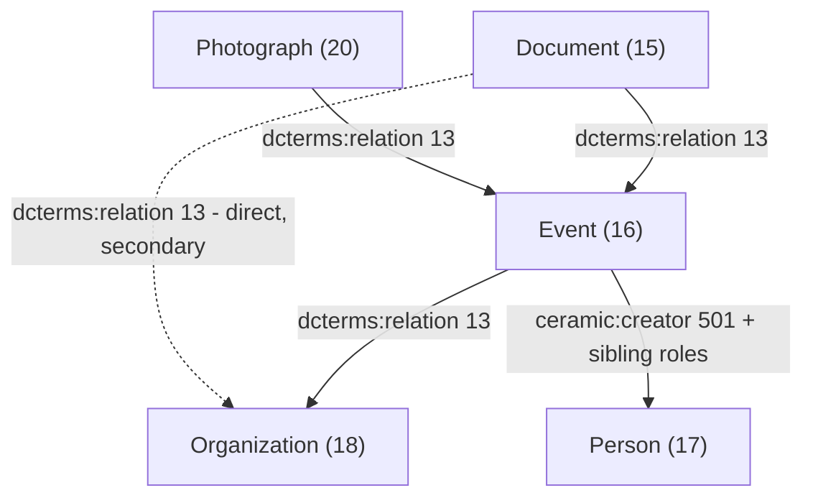

# Data Model & Relationships

Single reference for the Event-centric graph this theme traverses. Read this before
writing or changing any code that walks between item types (helpers, page templates,
search). Traversal rules are governed by the **SecondDegreeResources usage policy** in
`CLAUDE.md`: reuse the rules below, do not fork them, and discuss before changing them.

---

## 1. Resource templates

| Type          | Template ID | Resource class         | Notes |
|---------------|-------------|------------------------|-------|
| Documents     | 15          | `ceramic:Document`     | Carries media (images); may be a video (see §5) |
| Events        | 16          | `ceramic:Event`        | The hub of the graph; has **no media of its own** |
| People        | 17          | `ceramic:Person`       | |
| Organizations | 18          | `ceramic:Organization` | The curated set for the home page is item set **4211** |
| Photographs   | 20          | *(photograph template)*| Behaves like a Document in every traversal |

Documents (15) and Photographs (20) are always traversed as a pair. In the faceted
search UI they are also *displayed* as one "מסמכים" checkbox.

## 2. Properties used as edges

| Property | ID | Used for |
|---|---|---|
| `dcterms:relation` | 13 | Doc/Photo → Event, Doc/Photo → Org, Event → Org |
| `ceramic:creator` | 501 | Event → Person (the primary creator role) |
| sibling creator roles | 502, 518, 511, 514, 503, 500, 506, 504 | Event → Person under other roles (curator, etc.) |
| `dcterms:title` | 1 | Search (`in` = contains) |
| `dcterms:date` | — | Sorting and decade facets |
| `dcterms:type` | — | Event type facet; also marks a Document as video (`וידאו`) |
| `cidoc:P19i_was_made_for` | — | Event *domain* facet (custom vocab #9); only on Events whose `dcterms:type` is `אירוע` |

The nine creator-role property ids are declared as `ROLE_PROPS` in
[helper/ItemRelations.php](helper/ItemRelations.php) and mirrored in
[helper/FacetedSearch.php](helper/FacetedSearch.php). Their human labels are not
hardcoded — `ItemRelations::eventsByRole()` reads each property's label at runtime so it
appears in the site language.

## 3. Edge directions (which item holds the value)

Direction matters: every edge below is stored on the item at the **tail** of the arrow,
so walking the other way is a *subject* (reverse) lookup — an API query of the form
`property[0] = {property: <id>, type: 'res', text: <targetId>}`.

- **Document/Photograph → Event** — the Doc/Photo holds the value.
- **Event → Organization** — the *Event* holds the value. An Org page therefore finds its
  Events by reverse lookup.
- **Event → Person** — the *Event* holds the value, under one of the creator-role
  properties. A Person page finds their Events by reverse lookup.
- **Document → Organization (direct, dashed)** — exists in the data, but is **not** part
  of the canonical Organization second-degree config and is deliberately not used for the
  home page's "פריטים נבחרים" section.

People and Documents/Photographs are **siblings** under an Event. A Person is never an
intermediate node between an Organization and a Document.

## 4. Standard traversals

| From | To | Path | Implemented in |
|---|---|---|---|
| Person | Events | reverse via role props | `ItemRelations::events()` / `eventsByRole()` |
| Org | Events | reverse via 13 | `ItemRelations::events()` |
| Person/Org | Docs + Photos | Events, then reverse via 13 | `ItemRelations::relatedByTemplate()`, `galleryTiles()` |
| Org | People | Events, then forward via role props | `linked-resources.phtml` config 18 → "People in Events" |
| Doc/Photo | Event / Org / Person | forward via 13, then Event's values | `HomeGraph::walkToType()` |
| Org item set | Docs + Photos (grandchildren) | Orgs → reverse 13 → Events → reverse 13 → Docs/Photos | `HomeGraph::orgDescendantPool()` |
| Doc | Event's domain / type | forward via 13, then Event's `cidoc:P19i_was_made_for` / `dcterms:type` | `FacetedSearch` |
| Doc/Photo | parent Event | forward via 13, first value with template 16 | `ItemRelations::parentResource()` |
| Event | parent Org | forward via 13, first value with template 18 | `ItemRelations::parentResource()` |
| Event | its People, by role | forward via role props | `ItemRelations::creatorGroups()` |
| Doc/Photo | its People, by role | parent Event, then forward via role props | `ItemRelations::creatorGroups()` |
| Event | Docs + Photos | reverse via 13, both templates merged | `ItemRelations::relatedDocsAndPhotos()` |

The last five rows feed the item-child item pages (`view/common/item-document.phtml`,
`view/common/item-event.phtml`) — see **Item show pages** in `CLAUDE.md`. They introduce no
new edges: `parentResource()` walks the existing Doc/Photo → Event and Event → Org edges
forwards, and `creatorGroups()` walks the existing Event → Person role edges forwards.
`parentResource()` falls back to a directly-referenced Org or Person for a Document that has
no Event (the dashed edge in §3), since otherwise such a Document would show no parent bar.

The canonical, production-tested configuration of these edges is the
`$secondDegreeConfigs` array in
[view/common/resource-page-block-layout/linked-resources.phtml](view/common/resource-page-block-layout/linked-resources.phtml),
consumed by [helper/SecondDegreeResources.php](helper/SecondDegreeResources.php). Treat it
as the source of truth when the helpers disagree.

## 5. Node quirks

- **Events have no media.** Anything that needs a picture for an Event borrows one from a
  connected Document (`ItemRelations::eventThumbnail()`, and the home page Discover tiles,
  which start from an image-bearing Doc/Photo and walk *up*).
- **Video Documents.** A Document/Photograph whose `dcterms:type` is `וידאו` has no image
  media; its tile is a YouTube embed built from `bibo:uri`.
- **Site scoping.** `ItemRelations`, `HomeGraph` and `FacetedSearch` always add `site_id`
  to their queries. `SecondDegreeResources` only does so when the
  `exclude_resources_not_in_site` site setting is on.

## 6. Known inconsistencies (open)

1. **`HomeGraph` narrows the Event → Person edge to `ceramic:creator` (501) only.**
   [`HomeGraph::walkToType()`](helper/HomeGraph.php) uses `firstResourceValue($event,
   'ceramic:creator', TPL_PERSON)`, whereas `ItemRelations::ROLE_PROPS` and the
   Organization config in `linked-resources.phtml` use all nine role properties. A Person
   linked to an Event only under another role (e.g. curator, 502) can never surface in the
   home page's "אנשים" Discover tile. Left as-is deliberately; revisit if the tile looks
   too narrow.
2. **The canonical config itself disagrees on the Person → Event edge.** The Person block
   (template 17) in `linked-resources.phtml` uses `firstDegreePropertyIds: [501]`, while
   `ItemRelations::events()` uses all nine `ROLE_PROPS` for the same hop. Pre-existing;
   the two code paths can therefore return different Event sets for the same Person.

Other open items that touch the graph are listed under **Faceted search / results page →
Open items** in `CLAUDE.md`.
